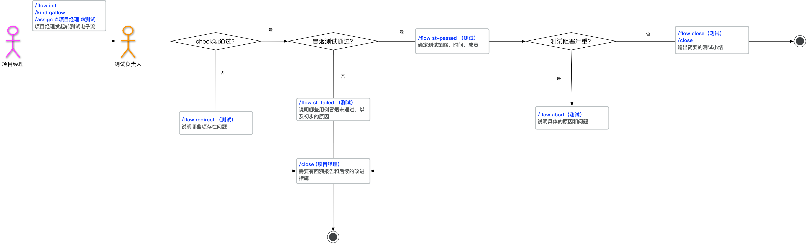

<!-- START doctoc generated TOC please keep comment here to allow auto update -->
<!-- DON'T EDIT THIS SECTION, INSTEAD RE-RUN doctoc TO UPDATE -->
**Table of Contents**  *generated with [DocToc](https://github.com/thlorenz/doctoc)*

- [QAflow 转测试电子流](#qaflow-%E8%BD%AC%E6%B5%8B%E8%AF%95%E7%94%B5%E5%AD%90%E6%B5%81)
  - [具体流程说明](#%E5%85%B7%E4%BD%93%E6%B5%81%E7%A8%8B%E8%AF%B4%E6%98%8E)
  - [检查项说明](#%E6%A3%80%E6%9F%A5%E9%A1%B9%E8%AF%B4%E6%98%8E)

<!-- END doctoc generated TOC please keep comment here to allow auto update -->

# QAflow 转测试电子流

## 具体流程说明

- 项目经理发起转测试流程（其中包含了各个检查项），并 `/assign @项目负责人 @QA负责人` 
- 测试负责人接收到转测试电子流，检查各个 checklist；如果通过则进入冒烟测试环节；否则 `/flow redirect` 返回给项目经理，提供回述报告和后续的改进措施后， `/close` 关闭转测试流程
- 测试冒烟测试通过后，`/flow st-passed` ，并确定测试总体策略、测试时间、测试投入人员；否则 `/flow st-failed` 返回给项目经理，提供回述报告和后续的改进措施后， `/close` 关闭转测试流程
- 如果在测试过程中出现严重阻塞测试执行的情况，比如：环境持续性异常，导致测试效率降低，则异常终止测试 `/flow abort` 返回给项目经理，并提供回述报告和后续的改进措施后， `/close` 关闭转测试流程
- 如果测试正常结束，打上标签 `/flow close` ，并输出简要的测试小结（一般包括测试实际时间，投入人力，发现问题情况），并关闭转测试流程



## 检查项说明

- 冒烟测试结果：Compass，Clever 首轮 rc01 版本转测试时需要同时包含验收测试结果；项目测试在首轮冒烟测试中，会增加新特性验收内容。
- 缺陷答复率：当前只针对 Compass，Clever
- 需求澄清完成：只针对补丁和项目版本（首轮测试或者测试范围变化时）
- 如果项目经理因为延期或者提前需要在 期望计划测试时间 增加 重计划测试时间，不覆盖原有的测试计划

```
1. 冒烟测试结果（首次转测试还需提供验收测试结果） 
    - [ ] N/A 
    - [ ] Failed 链接:
    - [ ] Passed 链接:

2. 缺陷答复率满足转测试要求（Only for Product）
    - [ ] N/A
    - [ ] No
    - [ ] Yes 

3. 需求澄清完成 (for Patch and Project)
    - [ ] N/A
    - [ ] No 
    - [ ] Yes 

4. 提供开发修改清单
    - [ ] N/A 
    - [ ] No
    - [ ] Yes 链接： 

5. 提供安装或者升级包获取路径，以及配套工具 
    - [ ] N/A 
    - [ ] No
    - [ ] Yes 链接：

6. 提供验证环境地址 
    - [ ] N/A 
    - [ ] No
    - [ ] Yes 环境地址：

7. 其他说明和注意事项（如合入问题list，项目背景等）

8. 期望计划测试时间: yyyy/mm/dd - yyyy/mm/dd
    重计划测试时间:
```